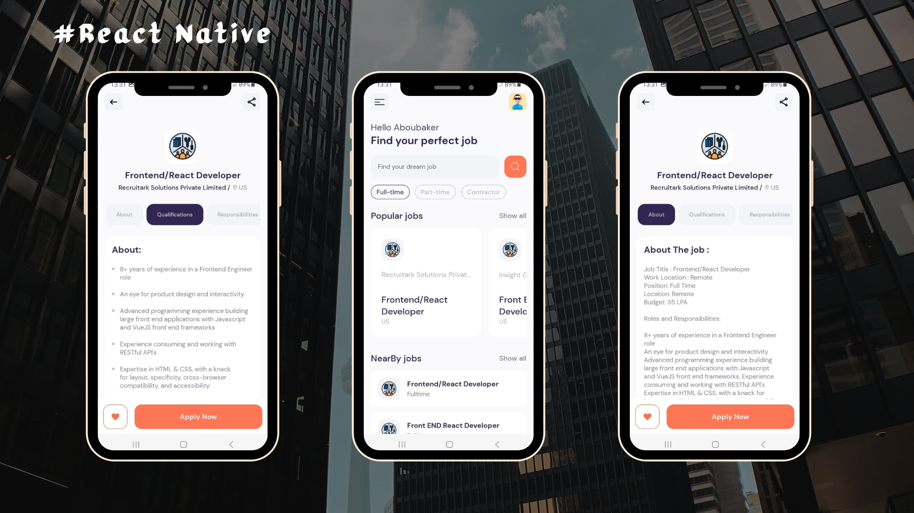

# Jobs Application
The Jobs Finder is a mobile app I built using React Native and Expo Router. It was my first React Native project, following a YouTube tutorial. The app streamlines the job search process by allowing users to search, filter, and save job listings. Through this project, I gained hands-on experience with React Native, Expo Router, and API integration. I'm enthusiastic about furthering my skills as a junior developer and creating more impactful mobile applications in the future.

## Screenshot

